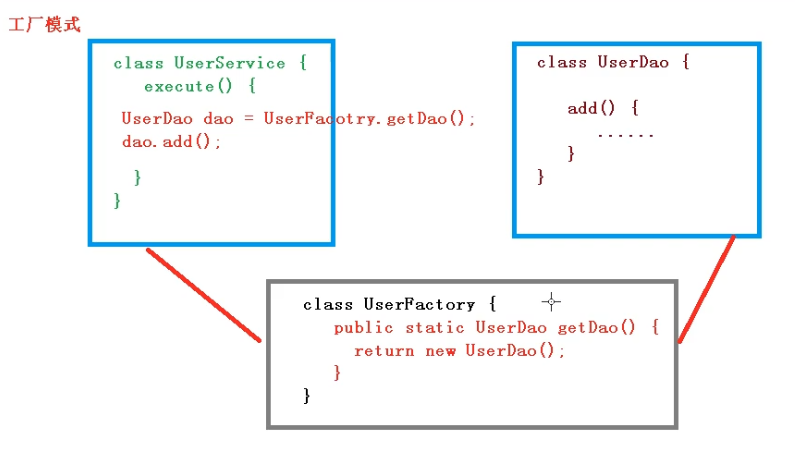
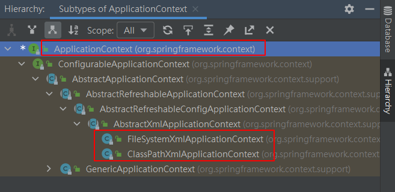

# Java Spring

Spring 筆記

# Spring 框架概述

1. Spring是輕量級的開源JavaEE框架

2. Spring可以解決企業開發的複雜性

3. Spring有兩個核心部分： IOC和AOP
    - IOC：控制反轉，把創建對象過程交給Spring進行管理
    - AOP：面向切面，不修改源代碼進行功能增強

4. Spring特點
    - 方便解耦，簡化開發
    - AOP編程支持
    - 方便程序測試
    - 方便和其它框架進行整合
    - 方便進行事務操作
    - 降低API開發難度

# Spring官網

https://spring.io/


GA表示是穩定的版本


# Spring Github

https://github.com/spring-projects/spring-framework


https://repo.spring.io/ui/repos/tree/General/release


https://repo.spring.io/artifactory/release/org/springframework/spring


使用5.2.6的版本


下載資源的資料夾結構


# 打開IDEA，創建普通JAVA項目


spring結構圖


創建lib資料夾，拷貝這四個jar包


下載commons-logging-1.1.1.jar包

https://mvnrepository.com/artifact/commons-logging/commons-logging/1.1.1


也拷貝到lib資料夾


導入這5個jar包


新建xml時，有sping模版可以選


創建對應的包及類，並看到成功運行的信息，成功使用sping創建對象


User.java

```java
package com.ives.sping5;

public class User {
    public void add(){
        System.out.println("add.........");
    }
}

```

bean1.xml

```xml
<?xml version="1.0" encoding="UTF-8"?>
<beans xmlns="http://www.springframework.org/schema/beans"
       xmlns:xsi="http://www.w3.org/2001/XMLSchema-instance"
       xsi:schemaLocation="http://www.springframework.org/schema/beans http://www.springframework.org/schema/beans/spring-beans.xsd">
    <!--配置User對象創建-->
    <bean id="user" class="com.ives.sping5.User"></bean>
</beans>

```

TestSpring5.java
```java

import org.junit.Test;
import org.springframework.context.ApplicationContext;
import org.springframework.context.support.ClassPathXmlApplicationContext;

public class TestSpring5 {

    @Test
    public void testAdd(){
        // 1.加載spring配置文件
        ApplicationContext context = new ClassPathXmlApplicationContext("bean1.xml");

        // 獲取配置創建的對象
        User user = context.getBean("user",User.class);

        System.out.println(user);

        user.add();
    }
}
```

# IOC概念和原理

## 什麼是IOC

1. 控制反轉，把對象創建和對象之間的調用過程，交給Spring進行管理
2. 使用IOC目的：為了耦合度降低
3. 上一個例子即是IOC的實現

## IOC 底層原理

xml解析、工廠模式、反射

工廠模式，目的：耦合度降低最低限度



## IOC過程

進一步降低耦合度

1. 配置xml文件，配置創建的對象
```xml
<bean id="user" class="com.ives.sping5.User"></bean>
```

2. 有service類和dao類，創建工廠類
```java
class UserFactory{
    public static UserDao getDao(){
        String classValue = class屬性值; // xml解析
        Class clazz = Class.forName(classValue);    // 通過反射創建對象
        return (UserDao)clazz.newInstance();
    }
}
```

# IOC接口

1. IOC思想基於IOC容器完成，IOC容器底層就是對象工廠

2. Spring提供IOC容器實現兩種方式：(兩個接口)
    - BeanFactory
    IOC容器基本實現，是Spring內部的使用接口，不提供開發人員進行使用
    ```java
    BeanFactory context = new ClassPathXmlApplicationContext("bean1.xml");
    ```
    *加載文件時不會創建對象，在獲取對象(使用)才會倉建對象

    - ApplicationContext：BeanFactory接口的子接口，提供更多更強大的功能，一般由開發人員進行使用
    *加戴配置文件時候就會把配置文件對象進行創建

3. ApplicationContext接口有實現類  



# IOC操作Bean管理概念

## 什麼是Bean管理

Bean管理指的是兩個操作

1. Spring創建對象
2. Spring注入對象

## Bean管理操作有兩種方式

1. 基於xml配置文件方式實現
2. 基於註解方式實現

# IOC操作Bean管理(基於xml方式)

## 基於xml方式創建對象

```xml
<!--配置User對象創建-->
<bean id="user" class="com.ives.sping5.User"></bean>
```

1. 在spring配置文件中，使用bean標籤，標籤裡面添加對應屬性，就可以實現對象創建

2. 在bean標籤有很多屬性，判紹常用的屬性
- id屬性：唯一標識
- class屬性：類全路徑(包類路徑)

3. 創建對象時候，默認也是執行無參數構造方法，完成對象創建

## 基於xml方式注入對象

DI：依賴注入，就是注入屬性

### 第一種注入方式：使用set方法進行注入

- 創建類，定義屬性及對應的set方法
- 在spring配置文件配置對象創建，配置屬性注入

```xml
<!--set方法注入屬性-->
    <bean id="book" class="com.ives.sping5.Book">
        <!--使用property完成屬性注入
            name：類裡面屬性名稱
            value：向屬性注入的值
        -->
        <property name="bname" value="三國志"></property>
        <property name="bauthor" value="吳承志"></property>
    </bean>
```

### 第二種注入方式：使用有參數構造進行注入
- 創建類，定義屬性, 創建屬性對應的有參數構造方法

```java
public class Orders {
    // 屬性
    private String oname;
    private String address;

    // 有參數構造
    public Orders(String oname, String address) {
        this.oname = oname;
        this.address = address;
    }
}
```

- 在spring配置文件中進行配置

```xml
<!--有參數構造注入屬性-->
<bean id="orders" class="com.ives.sping5.Orders">
    <constructor-arg name="oname" value="蘋果電腦Mac"></constructor-arg>
    <constructor-arg name="address" value="Taipei"></constructor-arg>
</bean>
```

### p名稱空間注入(了解)

1. 使用p名稱空間注入，可以簡化基於xml配置方式

第一步 添加p名稱空間在配置文件中

```xml
xmlns:p="http://www.springframework.org/schema/p"
```

第二步 進行屬性注入，在bean標籤裡面裡行操作

```xml
<bean id="book" class="com.ives.sping5.Book" p:bname="金庸" p:bauthor="天龍八部">
    </bean>
```

# IOC操作Bean管理 - xml注入其它類型屬性

## 字面量

- null值

```xml
<property name="address">
    <null/>
</property>
```

- 屬性值包含特殊符號

```xml
<!--屬性包含特殊符號
    1. 把<>進行轉譯 &lt;&gt;
    2. 把特殊符號內容寫到CDATA
-->
<property name="address" >
    <value><![CDATA[<<台北>>]]></value>
</property>
```
