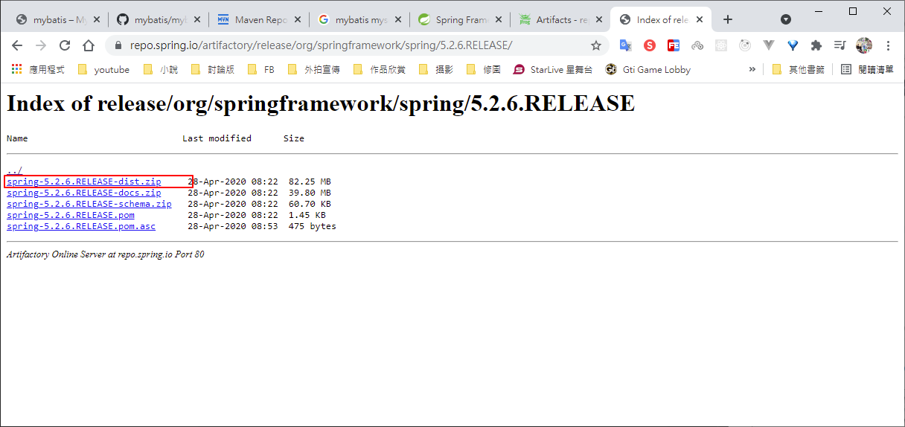

# Java Spring

Spring 筆記

# Spring 框架概述

1. Spring是輕量級的開源JavaEE框架

2. Spring可以解決企業開發的複雜性

3. Spring有兩個核心部分： IOC和AOP
    - IOC：控制反轉，把創建對象過程交給Spring進行管理
    - AOP：面向切面，不修改源代碼進行功能增強

4. Spring特點
    - 方便解耦，簡化開發
    - AOP編程支持
    - 方便程序測試
    - 方便和其它框架進行整合
    - 方便進行事務操作
    - 降低API開發難度

# Spring官網

https://spring.io/


GA表示是穩定的版本


# Spring Github

https://github.com/spring-projects/spring-framework


https://repo.spring.io/ui/repos/tree/General/release


https://repo.spring.io/artifactory/release/org/springframework/spring


使用5.2.6的版本




下載資源的資料夾結構


# 打開IDEA，創建普通JAVA項目


spring結構圖


創建lib資料夾，拷貝這四個jar包


下載commons-logging-1.1.1.jar包

https://mvnrepository.com/artifact/commons-logging/commons-logging/1.1.1


也拷貝到lib資料夾


導入這5個jar包


新建xml時，有sping模版可以選


創建對應的包及類，並看到成功運行的信息，成功使用sping創建對象


User.java

```java
package com.ives.sping5;

public class User {
    public void add(){
        System.out.println("add.........");
    }
}

```

bean1.xml

```xml
<?xml version="1.0" encoding="UTF-8"?>
<beans xmlns="http://www.springframework.org/schema/beans"
       xmlns:xsi="http://www.w3.org/2001/XMLSchema-instance"
       xsi:schemaLocation="http://www.springframework.org/schema/beans http://www.springframework.org/schema/beans/spring-beans.xsd">
    <!--配置User對象創建-->
    <bean id="user" class="com.ives.sping5.User"></bean>
</beans>

```

TestSpring5.java
```java

import org.junit.Test;
import org.springframework.context.ApplicationContext;
import org.springframework.context.support.ClassPathXmlApplicationContext;

public class TestSpring5 {

    @Test
    public void testAdd(){
        // 1.加載spring配置文件
        ApplicationContext context = new ClassPathXmlApplicationContext("bean1.xml");

        // 獲取配置創建的對象
        User user = context.getBean("user",User.class);

        System.out.println(user);

        user.add();
    }
}

```


